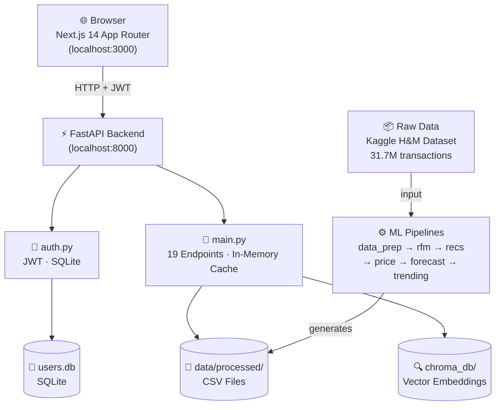
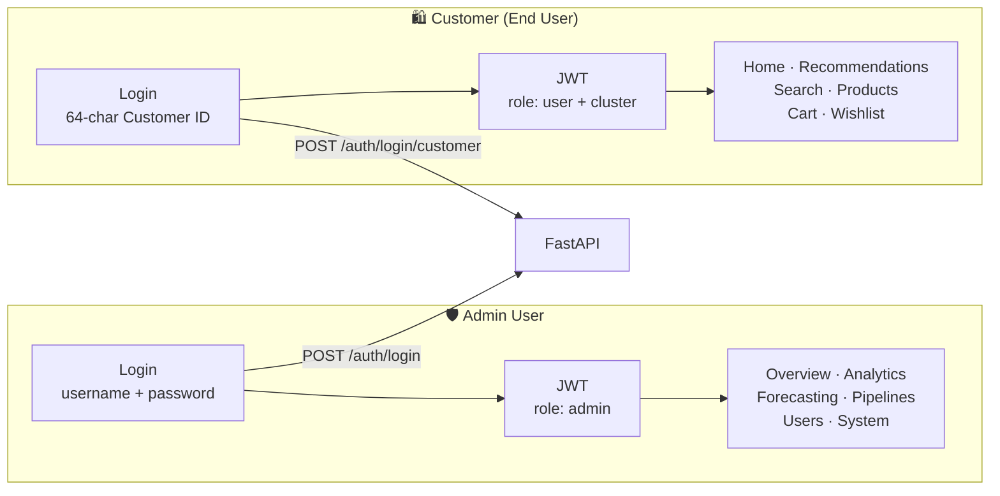
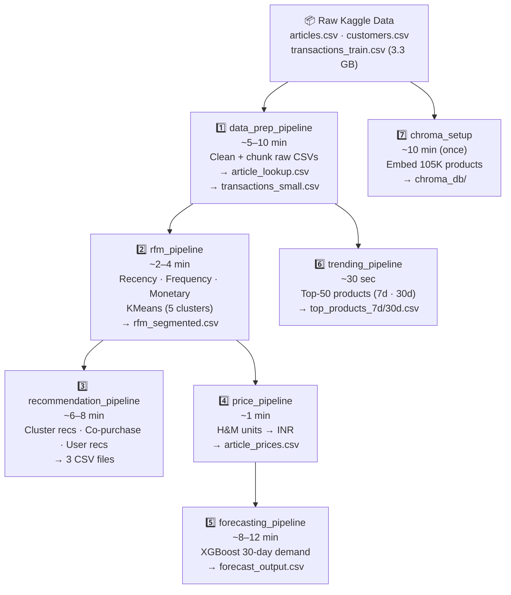
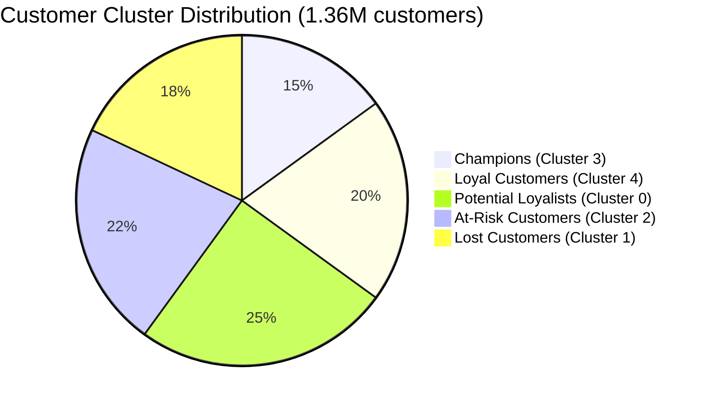
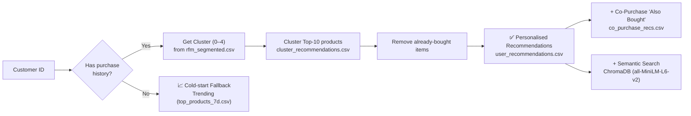

# H&M Retail AI — Personalized Recommendation System

A full-stack AI-powered retail analytics platform built on the H&M Personalized Fashion Recommendations dataset.  
**FastAPI backend · Next.js 14 frontend · XGBoost forecasting · ChromaDB semantic search · RFM segmentation**

---

## System Architecture



---

## User Journey



---

## ML Pipeline Execution Order



---

## RFM Customer Segmentation



---

## Recommendation Engine Logic



---

## Features

| Module | Description |
|--------|-------------|
| **Recommendations** | Cluster-based collaborative filtering (RFM + co-purchase analysis) |
| **Semantic Search** | ChromaDB + `all-MiniLM-L6-v2` sentence-transformers |
| **Demand Forecasting** | XGBoost 30-day demand forecast per article with daily breakdown |
| **RFM Segmentation** | K-Means clustering → Champions / Loyal / Potential / At-Risk / Lost |
| **Trending** | Rolling 7-day and 30-day top products from transaction history |
| **Admin Dashboard** | KPIs, forecast charts, cluster stats, system health |

---

## Dataset

Download the raw data from Kaggle and place files in `data/raw/`:

**[H&M Personalized Fashion Recommendations — Kaggle](https://www.kaggle.com/competitions/h-and-m-personalized-fashion-recommendations/data)**

Required files:
```
data/raw/
  articles.csv          (~35 MB)   — product metadata
  customers.csv         (~199 MB)  — customer demographics
  transactions_train.csv (~3.3 GB) — purchase history
```

---

## Project Structure

```
hm_recommendation_system/
├── api/                        # FastAPI backend
│   ├── main.py                 # All API endpoints
│   ├── auth.py                 # JWT authentication
│   └── models.py               # Pydantic schemas
├── pipelines/                  # One-time data generation scripts
│   ├── data_prep_pipeline.py   # Cleans raw data
│   ├── rfm_pipeline.py         # RFM segmentation + clustering
│   ├── recommendation_pipeline.py  # User recommendations
│   ├── price_pipeline.py       # INR price generation
│   ├── trending_pipeline.py    # Top 7d/30d trending products
│   └── full_retraining_pipeline.py
├── forecasting/                # XGBoost demand forecasting
│   ├── feature_engineering.py
│   ├── model_training.py
│   └── predict.py
├── utils/
│   ├── chroma_setup.py         # Build ChromaDB index
│   └── chroma_search.py        # Semantic search interface
├── models/
│   └── xgb_demand_model.pkl    # Trained XGBoost model
├── data/
│   ├── raw/                    # ← Download from Kaggle (not in repo)
│   └── processed/              # ← Generated by pipelines (large files excluded)
│       ├── article_prices.csv          ✓ included
│       ├── forecast_output.csv         ✓ included
│       ├── forecast_summary.csv        ✓ included
│       ├── co_purchase_recs.csv        ✓ included
│       ├── cluster_recommendations.csv ✓ included
│       ├── top_products_7d.csv         ✓ included
│       └── top_products_30d.csv        ✓ included
├── frontend/                   # Next.js 14 frontend
│   ├── app/                    # App Router pages
│   ├── components/             # Reusable UI components
│   ├── services/api.ts         # API client
│   ├── store/                  # Zustand state (auth, cart)
│   └── types/                  # TypeScript interfaces
├── notebooks/                  # Jupyter exploration notebooks
├── PROJECT_WORKFLOW.md         # Full system deep-dive
└── requirements.txt
```

---

## Setup

### 1. Python backend

```bash
python -m venv venv
venv\Scripts\activate          # Windows
pip install -r requirements.txt
```

### 2. Generate processed data (after downloading Kaggle dataset)

Run pipelines in order:

```bash
python -m pipelines.data_prep_pipeline
python -m pipelines.rfm_pipeline
python -m pipelines.recommendation_pipeline
python -m pipelines.price_pipeline
python -m pipelines.trending_pipeline
python -m forecasting.model_training
python -m forecasting.predict
python -m utils.chroma_setup
```

### 3. Start the backend

```bash
uvicorn api.main:app --reload --port 8000
```

### 4. Frontend

```bash
cd frontend
npm install
# Create frontend/.env.local:
# NEXT_PUBLIC_API_URL=http://localhost:8000
npm run dev
```

Open [http://localhost:3000](http://localhost:3000)

---

## Default Credentials

| Role | Username | Password |
|------|----------|----------|
| Admin | `admin` | `admin123` |
| User | `koustubh` | `user123` |
| Customer ID | `00006413d8573cd20ed7128e53b7b13819fe5cfc2d801fe7fc0f26dd8d65a85a` | *(no password)* |

---

## Tech Stack

**Backend:** Python 3.11 · FastAPI · Pandas · XGBoost · Scikit-learn · ChromaDB · Sentence-Transformers · SQLite · JWT  
**Frontend:** Next.js 14 · TypeScript · Tailwind CSS · Recharts · Zustand · Sonner  
**ML:** K-Means RFM clustering · XGBoost demand forecasting · Collaborative filtering · Semantic vector search
